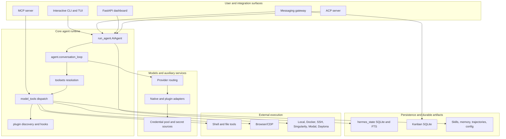
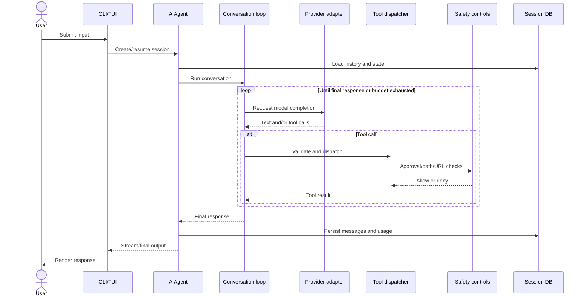
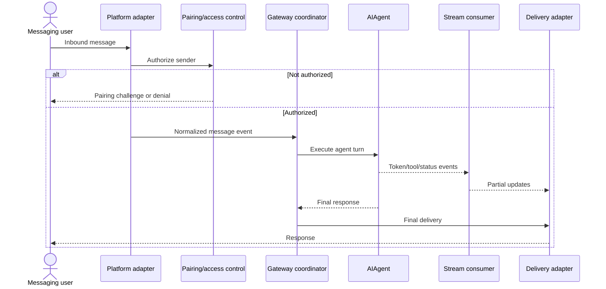
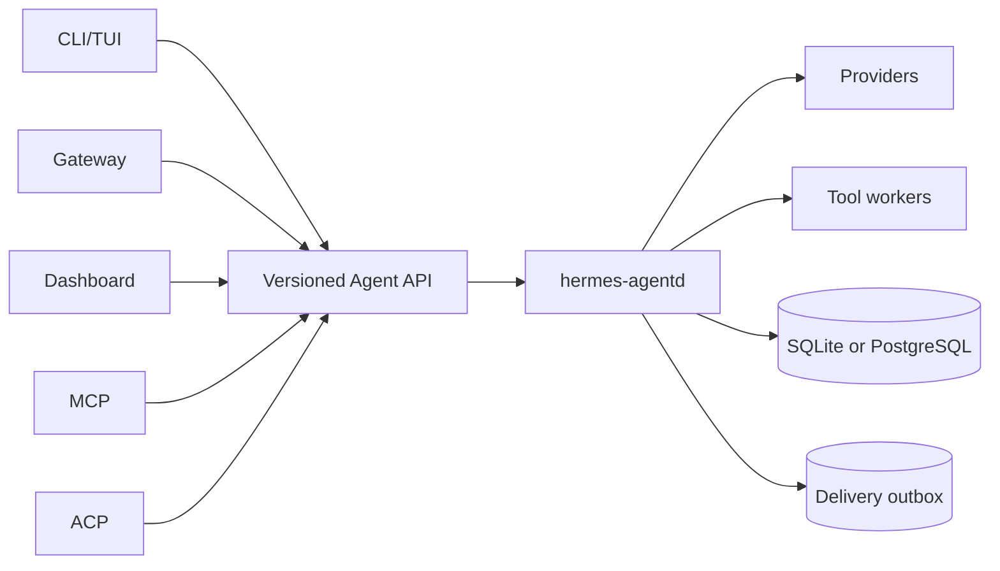
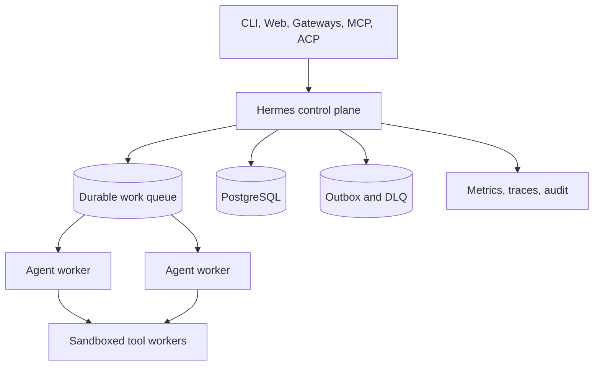

# Hermes Agent — Third-Party Consultant Audit Dossier

> **Audit scope:** `/Users/chidionyema/.hermes/hermes-agent`
>
> **Audit type:** Read-only, source-level architecture and operational audit.
>
> **Audience:** Independent consultants advising on substantial improvement or rearchitecture for exceptional stability, resilience, security, scalability, and operational seamlessness.
>
> **Important limitation:** This audit used repository source and operations artifacts only. It did not include production logs, metrics, traces, incident history, load tests, or stakeholder interviews. Claims marked as gaps or hypotheses must be validated before architectural commitments.

## 1. Executive summary

Hermes Agent is a mature, broad Python 3.11+ personal-agent platform rather than a narrow conversational agent. It includes an interactive CLI/TUI, a multi-platform messaging gateway, MCP and ACP integrations, a browser dashboard, model-provider routing, tools and approvals, multiple memory providers, scheduled jobs, kanban/work-management capabilities, skill curation, and extensive packaging support.

Its strongest qualities are operational breadth, defensive security controls, explicit dependency pinning, a large test estate, SQLite repair and WAL fallback logic, platform packaging, and practical operator commands such as doctor, update, backup, logs, and status.

Its principal architectural risk is concentration: several critical files contain thousands of lines and combine policy, orchestration, integration, and lifecycle logic. The runtime also mixes synchronous and asynchronous execution, uses SQLite as a broad coordination mechanism, and lacks several production-grade resilience patterns: a global circuit breaker, transactional delivery outbox, dead-letter queues, first-party metrics/SLOs, restore drills, and fault-injection evidence.

### Overall maturity

| Dimension | Score (1–5) | Summary |
|---|---:|---|
| Stability | 4.0 | Strong local persistence safeguards, migrations, dependency controls, and recovery mechanics. |
| Security | 4.0 | Layered command approval, filesystem restrictions, pairing, SSRF controls, and skill auditing. |
| Operability | 3.5 | Strong diagnostics and packaging; weak SLOs, alerting, incident runbooks, and restore drills. |
| Resilience | 3.0 | Restart and DB recovery exist; missing loop-level circuit breaking, durable delivery, and chaos evidence. |
| Code organization | 2.5 | Several oversized critical modules materially increase review and change risk. |
| Observability | 3.0 | Structured logs and optional tracing exist; first-party metrics and end-to-end correlation are incomplete. |
| Scalability | 2.0 | Single-process and SQLite-oriented architecture is appropriate for personal use but limits horizontal scale. |
| Testing | 3.5 | Large suite and CI slicing; no visible coverage gate, mutation testing, or comprehensive fault injection. |
| Deployment | 4.0 | Python packaging, Docker, Nix, Homebrew, Windows, Termux, and service-manager support. |

**Composite assessment: approximately 3.3/5.** Hermes is strong for a sophisticated personal-agent product but would need architectural and operational hardening to support stringent shared-team, enterprise, or high-availability expectations.

## 2. Product purpose and system boundaries

The repository describes Hermes as a self-improving agent with skills, learning, conversation recall, and persistent user modeling. Its operating model appears primarily single-user or small-team, running locally or on a VPS, with optional message-platform gateways.

### Important boundaries

| Boundary | Primary enforcement |
|---|---|
| Agent to host shell | `tools/approval.py`; dangerous-command approval; import-time frozen YOLO mode. |
| Agent to filesystem | `agent/file_safety.py`, `tools/path_security.py`, `tools/file_operations.py`. |
| Agent to network | `tools/url_safety.py`; host/IP blocks and redirect revalidation. |
| Messaging sender to gateway | `gateway/pairing.py`, slash-command access controls. |
| Agent to external skills/plugins | Skill guard, provenance, AST audit, plugin loading controls. |
| Agent to model providers | Provider adapters, credential sources/pools, rate-limit handling. |
| Agent to execution environment | Local, Docker, SSH, Singularity, Modal, Daytona environment backends. |

### Architectural scope warning

Hermes is not merely an LLM loop. Any serious rearchitecture must account for these coupled product surfaces:

- Interactive CLI/TUI
- Messaging gateway and platform adapters
- Model/provider abstraction
- Tool execution and approvals
- Persistent sessions and search
- Skills and plugin lifecycle
- Memory providers
- Cron and background execution
- Dashboard and APIs
- MCP and ACP protocols
- Packaging, installers, services, and upgrades

## 3. Repository and module map

```text
hermes-agent/
├── run_agent.py                 # Core AIAgent entry and runtime orchestration
├── cli.py                       # Large interactive CLI / prompt loop
├── model_tools.py               # Tool schemas, validation, dispatch, hooks
├── toolsets.py                  # Toolset composition and resolution
├── hermes_state.py              # SQLite sessions, migrations, FTS, repair
├── hermes_constants.py          # Paths, environment, import-safe constants
├── hermes_logging.py            # Logging configuration
├── batch_runner.py              # Batch trajectory generation
├── trajectory_compressor.py     # Training/trajectory preparation
├── mcp_serve.py                 # MCP server
├── agent/                       # Conversation, provider, prompt, memory logic
├── tools/                       # Concrete tools, security, environments
├── gateway/                     # Messaging orchestration and adapters
├── hermes_cli/                  # `hermes` command implementation
├── cron/                        # Scheduling and delivery
├── acp_adapter/                 # Agent Client Protocol server
├── providers/                   # Provider discovery/base abstractions
├── plugins/                     # Model, memory, platform, observability plugins
├── skills/                      # Bundled procedural skills
├── optional-skills/             # Install-on-demand skills
├── tui_gateway/                 # TUI-to-gateway bridge
├── apps/                        # Desktop/bootstrap applications
├── ui-tui/                      # Node TUI workspace
├── web/                         # Dashboard SPA
├── website/                     # Documentation site
├── docs/                        # Design, security, plans, RCA documents
└── tests/                       # Extensive test estate
```

### Concentrated modules requiring special review

The following files were identified as unusually large and architecturally sensitive:

- `cli.py` — approximately 14k lines
- `hermes_cli/main.py` — approximately 12.5k lines
- `hermes_cli/web_server.py` — approximately 12k lines
- `hermes_cli/auth.py` — approximately 8k lines
- `hermes_cli/kanban_db.py` — approximately 7.7k lines
- `hermes_cli/config.py` — approximately 6.6k lines
- `run_agent.py` — approximately 5.5k lines
- `hermes_state.py` — approximately 4.8k lines

These sizes are not defects by themselves, but they indicate high cognitive load, broad blast radius, difficult ownership boundaries, and increased regression risk.

## 4. High-level architecture



### Architectural interpretation

The core currently behaves as an in-process application framework. Multiple surfaces import and invoke the same Python implementation and share persistence. The boundary between reusable agent library, interactive application, gateway service, and operator platform is primarily conventional rather than enforced through stable service contracts.

That design is efficient for a local personal-agent product. It becomes a liability when seeking:

- Independent scaling of gateway and agent workloads
- Strong fault containment
- Stable versioned integration contracts
- Multiple concurrent users or hosts
- Rolling upgrades
- Durable delivery and recovery guarantees
- Clear component ownership

## 5. Runtime and control flow

### Interactive turn



### Gateway turn



### Key lifecycle phases

1. Bootstrap platform-specific I/O behavior.
2. Resolve profile, configuration, environment, provider, model, and toolsets.
3. Construct or resume the agent session.
4. Open and migrate SQLite state.
5. Build or restore the system prompt and context.
6. Execute model/tool iterations under an iteration budget.
7. Persist message, usage, and lifecycle state.
8. Compress, branch, or resume sessions where requested.
9. Perform cleanup, shutdown notification, and forensic recording.

## 6. Model and provider routing

Hermes supports a broad provider ecosystem through both built-in adapters under `agent/` and plugin providers under `plugins/model-providers/`. Configuration and interactive setup are spread across provider discovery, model catalogs, `hermes_cli/model_switch.py`, setup flows, credentials, and adapter-specific code.

### Strengths

- Wide provider coverage and graceful provider-specific support
- Credential pools with quarantine/rate-limit concepts
- Prompt caching and provider-specific reasoning support
- Lazy installation for provider-only dependencies
- Exact dependency pinning and supply-chain scanning

### Risks

1. Provider logic is distributed across three conceptual layers:
   - `providers/`
   - `plugins/model-providers/`
   - native adapters under `agent/`
2. Capability discovery appears partly implicit rather than expressed through one typed protocol.
3. Provider fallback, quarantine, and degradation are not uniformly observable.
4. Upstream model behavior may drift even when SDK versions are pinned.
5. Broad OAuth logic in `hermes_cli/auth.py` creates a concentrated security-review burden.

### Recommendation

Define one explicit `ProviderAdapter` contract with capability flags, including:

- Streaming
- Tool calling
- Structured output
- Vision/audio support
- Reasoning configuration
- Prompt caching
- Retry semantics
- Idempotency support
- Rate-limit metadata
- Authentication refresh
- Health status

Adapters should be contract-tested against this interface. Provider setup/OAuth should be separate from runtime inference.

## 7. Prompts, context, memory, and persistent state

### Prompt assembly

Relevant areas include:

- `agent/system_prompt.py`
- `agent/prompt_builder.py`
- `agent/conversation_loop.py`
- `agent/coding_context.py`
- `agent/context_references.py`

The system supports resumed prompts, runtime mismatch detection, structured prompt composition, code context, and external references.

### Context compression

Hermes includes multiple compression-related modules and session branching behavior. This is a meaningful strength: unbounded context growth is recognized as both a cost and reliability problem.

Consultants should verify:

- Compression quality under long tool-heavy sessions
- Preservation of approvals, unresolved tasks, and critical constraints
- Handling of media/tool references after compression
- Whether summaries are provider-neutral
- Whether compression failures are recoverable and observable

### Memory providers

The repository contains several memory plugins, including Honcho, Hindsight, Mem0, ByteRover, OpenViking, RetainDB, Supermemory, and Holographic approaches.

This flexibility provides experimentation value but introduces architectural questions:

- What is the canonical memory contract?
- Which provider owns deletion and privacy semantics?
- How are conflicting memories reconciled?
- How is retrieval quality measured?
- Are memory writes idempotent?
- How are migrations handled when switching providers?

### Session state

`hermes_state.py` is a central reliability component. It includes:

- SQLite schema migrations
- FTS5 indexes and triggers
- WAL mode with fallback to DELETE on incompatible filesystems
- Repair and backup logic
- Initialization error capture
- Concurrent-instance detection
- Incremental session persistence

This is strong for local-first operation. Its limitation is that SQLite remains a single-writer coordination point and is not a natural multi-host consistency substrate.

## 8. Tools, permissions, and trust boundaries

### Tool composition and dispatch

`toolsets.py` resolves built-in and plugin toolsets. `model_tools.py` validates and dispatches calls, emits hooks, tracks iteration usage, and limits/stores large outputs.

The centralized dispatcher is a valuable control point, but its size and breadth make it a high-risk module. It should become a small pipeline of independently testable stages:

1. Resolve tool
2. Validate/coerce input
3. Authorize
4. Apply budgets and circuit breakers
5. Execute
6. Normalize output
7. Redact and truncate
8. Persist audit event
9. Emit observability hooks

### Dangerous-command approval

`tools/approval.py` includes several thoughtful protections:

- Import-time frozen YOLO mode
- Context-variable session identity
- Interactive, gateway, and cron modes
- Persistent allowlisting
- Optional smart approval
- Pre/post approval hooks

### Filesystem controls

`agent/file_safety.py`, `tools/path_security.py`, and `tools/file_operations.py` enforce deny paths and sandbox/container path mappings.

### Network controls

`tools/url_safety.py` blocks cloud metadata destinations, normalizes URLs, and revalidates redirects. It documents DNS-rebinding/TOCTOU as a limitation.

For high-assurance deployment, application-level URL validation is not enough. Route agent egress through a policy-enforcing proxy that validates actual connection destinations, prevents DNS rebinding, restricts ports/protocols, and records auditable decisions.

### Skills and plugins

Skill provenance, guard, and AST audit mechanisms are promising. A stricter target state should include:

- Signed manifests
- Trusted publisher identities
- Revocation lists
- Declared capabilities/permissions
- Reproducible package hashes
- Install-time and run-time enforcement
- Quarantine and rollback

## 9. Orchestration, concurrency, and async execution

Hermes mixes synchronous and asynchronous patterns. The core agent path is substantially synchronous, with asynchronous helpers and thread pools around selected work. Gateway adapters and cron scheduling introduce additional concurrency models.

### Risks

- Long-running tools can impair interactive responsiveness.
- Cancellation semantics may differ across sync functions, threads, subprocesses, and async tasks.
- Context variables may not propagate uniformly across executors.
- Error handling and retries can be duplicated across layers.
- SQLite lock behavior becomes user-visible under concurrency.
- Shutdown ordering is difficult when browsers, terminals, gateways, and tasks are active.

### Target model

Adopt structured concurrency:

- One async task tree per agent turn
- Explicit cancellation scopes
- Timeouts per provider and tool
- Bounded concurrency pools
- Per-resource bulkheads
- Guaranteed cleanup/finally paths
- Correlation IDs propagated through all tasks and subprocesses
- No untracked background threads

## 10. Scheduled jobs, delivery, and recovery

The cron subsystem supports schedule parsing, toolset restrictions, delivery targets, pre-run scripts, timeout controls, and prompt-injection scanning.

### Missing high-reliability patterns

- Transactional outbox between state changes and external delivery
- Durable retry records
- Dead-letter queue
- Idempotency keys
- Retry classification by error type
- Delivery reconciliation
- Operator replay controls
- SLOs for scheduled execution and delivery

A scheduled job should not be considered successful merely because the agent produced output. Success must include durable handoff and confirmed or reconciled delivery according to a stated policy.

## 11. Persistence, locking, and consistency

### Current strengths

- SQLite WAL with filesystem-aware fallback
- Explicit schema migrations
- Repair claim lock and backup
- FTS synchronization triggers
- Partial-session preservation after interruption
- Separate kanban persistence

### Key concerns

1. SQLite provides one writer; gateway, cron, sessions, and kanban can create contention.
2. DELETE fallback protects correctness but reduces concurrency.
3. Multi-host coordination is difficult to guarantee with local SQLite.
4. Backup creation is not equivalent to validated restoration.
5. There is no evidence of recurring restore drills.
6. Cross-process locking relies heavily on SQLite semantics and selected local locks.

### Recommendation

Keep SQLite as a supported local-first backend but place it behind a formal `StateStore` interface. Add optional PostgreSQL for shared/multi-host deployments. Define transaction and consistency guarantees explicitly for:

- Session append
- Tool-call audit records
- Delivery outbox
- Scheduled jobs
- Credential state
- Kanban dispatch
- Memory writes

## 12. API and integration boundaries

Hermes exposes:

- MCP over stdio/JSON-RPC
- ACP over stdio
- TUI gateway over WebSocket
- Platform-specific webhook/event interfaces
- FastAPI dashboard endpoints
- Model-provider HTTP APIs

### Risks

- Dashboard endpoints do not appear to use a stable version prefix.
- Internal Python imports substitute for formal contracts in several surfaces.
- MCP/ACP compatibility policy and versioning are not clearly documented.
- Integration conformance tests should be stronger than implementation tests.

### Recommendation

Create explicit versioned contracts:

- `/api/v1/...` for dashboard/control APIs
- Versioned agent execution protocol
- MCP and ACP compatibility matrix
- JSON schemas or protobuf/OpenAPI artifacts
- Consumer-driven contract tests
- Deprecation policy and telemetry

## 13. Configuration and secrets

Hermes supports profiles, YAML configuration, environment variables, `.env`, provider-specific setup, credential pools, and secret-source plugins.

### Strengths

- Multiple secret sources
- Credential quarantine/routing
- Secret redaction
- Profile support
- Security audit commands

### Risks

- Configuration implementation is large and broadly coupled.
- Environment and profile propagation into subprocesses is critical and easy to miss.
- Provider OAuth logic is concentrated.
- Configuration validation and migration need strict compatibility tests.

### Recommendation

Separate configuration into:

1. Typed schema and defaults
2. Source loading
3. Merge and precedence
4. Validation
5. Migration
6. Secret resolution
7. Runtime snapshot

Every agent turn should reference an immutable configuration snapshot with a version/hash recorded in telemetry.

## 14. Security assessment

### Strong controls

- Pairing/access controls for messaging users
- Dangerous-command approval
- Filesystem write restrictions
- SSRF metadata blocks
- Redirect revalidation
- Secret redaction
- Skill provenance and AST audit
- Supply-chain workflows and exact pins
- Sandboxed execution backends

### Highest-priority security concerns

1. **DNS rebinding and connection-time egress validation**
2. **Plugin/skill trust and signature enforcement**
3. **Broad OAuth implementation surface**
4. **Subprocess environment/profile propagation**
5. **Gateway/dashboard API authentication and versioning**
6. **Audit completeness for tool execution and approvals**
7. **Prompt injection in cron, skills, retrieved context, and platform messages**

### Security target state

- Default-deny egress proxy
- Capability-based tool permissions
- Signed plugin/skill manifests
- Immutable audit log for sensitive actions
- Per-tool data-classification policy
- Secret broker rather than raw secret exposure
- Regular threat modeling and red-team scenarios
- Security-focused chaos tests

## 15. Observability and operational readiness

### Existing capabilities

- Structured logging
- Component logs and diagnostic dump
- Stream events
- Optional Langfuse and Nemo Relay plugins
- Usage and account quota tracking
- Memory monitor
- Operator panels
- Doctor, status, logs, backup, update, and service commands

### Gaps

- No clearly defined SLOs/SLIs
- No first-party Prometheus/OpenTelemetry metrics baseline
- Incomplete end-to-end correlation across CLI, gateway, providers, tools, and delivery
- No documented alert-routing strategy
- No formal incident-response runbook suite
- No recurring backup-restore drill
- Limited production evidence in this audit

### Minimum telemetry model

Every turn should emit a correlation record containing:

- Session/turn/tool-call IDs
- Surface and user/platform identity class
- Config and code version
- Provider/model/credential pool identity
- Prompt, completion, cache, and tool token counts
- Latency by stage
- Retry/fallback/quarantine events
- Approval decisions
- Tool outcome and redaction status
- Persistence timing
- Delivery attempt/result
- Final end reason

## 16. Deployment and CI/CD

The repository supports Python packaging, Docker, Nix, Homebrew, Windows installation, Termux, desktop packaging, and service-manager operation.

CI includes tests, linting, type checking, Docker lint/publish, Windows installer builds, dependency and supply-chain scanning, lockfile checks, docs builds/deployments, and skills-index maintenance.

### Strengths

- Broad deployment compatibility
- Dependency lock drift checks
- Explicit vulnerability scanning
- Installer-specific test coverage
- Platform packaging breadth

### Risks

- Broad platform support increases release-matrix complexity.
- Optional/lazy dependencies can create runtime-only failures.
- No documented progressive delivery or canary strategy.
- No clear compatibility matrix across Python, OS, provider, and gateway platform versions.

## 17. Testing and quality gates

The repository contains a large test estate and CI slicing. Integration tests are reportedly excluded by default through pytest markers.

### Gaps to close before major rearchitecture

- Produce a current coverage report by package and critical path.
- Set minimum coverage gates for core agent, state, security, and delivery code.
- Add property-based tests for argument coercion, URL/path safety, migration logic, and routing.
- Add mutation testing for approval and security controls.
- Add contract tests for providers, MCP, ACP, dashboard, and gateways.
- Add fault-injection tests for process death, provider timeout, disk-full, DB lock, corrupt state, duplicate delivery, and network partition.
- Add load and soak tests for long sessions and multi-platform gateway use.
- Validate backup restoration in CI or a scheduled staging job.

## 18. Failure-mode analysis

| Failure mode | Current posture | Required target posture |
|---|---|---|
| Provider network failure | Per-call retries/fallback concepts | Classified retries, circuit breaker, bulkhead, telemetry, operator override |
| Provider rate limiting | Credential-pool tracking | Global scheduling, retry budgets, fairness, degradation alerts |
| Runaway tool loop | Iteration budget | Cost/time budgets, repeated-call detection, circuit breaker, kill switch |
| Long tool blocks UI | Mixed sync/async | Async structured execution and reliable cancellation |
| NFS/SMB WAL incompatibility | DELETE fallback | Clear health signal, documented supported topology, optional external DB |
| Database corruption | Repair and backup | Restore drills, corruption metrics, operator runbook |
| Disk full | Limited evidence | Preflight capacity, bounded WAL/logs, graceful read-only mode |
| DNS rebinding | Known limitation | Connection-enforcing egress proxy |
| Plugin/skill compromise | Audit/provenance controls | Mandatory signatures, capabilities, revocation, sandbox |
| Cron delivery failure | Best-effort/retry behavior | Durable outbox, DLQ, idempotency, replay |
| Gateway crash/restart | Notifications and forensics | Health supervision, alerts, durable queue, reconciliation |
| Multi-gateway split brain | Coordination design | Lease/consensus semantics plus partition tests |
| Backup restore failure | Backup tooling | Automated recurring restore validation |
| Upstream model drift | Limited controls | Behavioral canaries, golden tasks, provider health scoring |

## 19. Evidence-backed priority findings

### P0/P1 findings

#### F-001 — No global agent-loop circuit breaker

**Evidence:** `agent/iteration_budget.py`; central dispatch in `model_tools.py`.

**Risk:** Repeated failing or oscillating tool calls may consume time and money until the iteration cap. An iteration cap is necessary but insufficient because it does not classify repeated failure patterns, escalating cost, or dependency outages.

**Recommendation:** Add per-turn time, token, cost, and failure budgets; repeated-call fingerprint detection; dependency circuit breakers; and explicit end reasons.

#### F-002 — Mixed synchronous and asynchronous architecture

**Evidence:** synchronous `run_agent.py` core with async helpers and gateway/thread-pool execution.

**Risk:** Cancellation, cleanup, context propagation, and responsiveness are harder to reason about. Long tool calls may block interactive surfaces.

**Recommendation:** Adopt an async-first core with structured concurrency, preserving sync adapters behind bounded executors during migration.

#### F-003 — Durable outbound delivery is incomplete

**Evidence:** gateway and cron delivery logic without a clearly identified transactional outbox and DLQ.

**Risk:** Agent output may be generated and persisted while external delivery fails or becomes ambiguous.

**Recommendation:** Add durable outbox records, idempotency keys, retry policy, delivery receipts, DLQ, replay, and reconciliation.

#### F-004 — DNS rebinding remains an acknowledged SSRF gap

**Evidence:** `tools/url_safety.py` documentation.

**Risk:** Validation-time DNS answers can differ from connection-time destinations.

**Recommendation:** Enforce network policy at the connection layer through a dedicated egress proxy or equivalent transport hook.

#### F-005 — Oversized critical modules increase change risk

**Evidence:** `cli.py`, `hermes_cli/main.py`, `hermes_cli/web_server.py`, `hermes_cli/auth.py`, `hermes_cli/kanban_db.py`, `hermes_cli/config.py`.

**Risk:** Broad blast radius, weak ownership boundaries, slow review, hidden coupling, and difficult testing.

**Recommendation:** Split by bounded context while preserving compatibility shims and characterization tests.

#### F-006 — SQLite constrains shared and multi-host operation

**Evidence:** central SQLite state and separate kanban SQLite, WAL/DELETE fallback, multi-gateway concerns.

**Risk:** Single-writer contention and limited distributed consistency.

**Recommendation:** Preserve SQLite for local-first use; introduce a formal state interface and PostgreSQL option for shared/high-availability deployments.

#### F-007 — Observability is not yet SLO-driven

**Evidence:** logs and optional tracing exist; no clear metrics baseline or SLO documents.

**Risk:** Incidents are found by users rather than objective signals; degradation cannot be quantified.

**Recommendation:** Define SLIs/SLOs, emit first-party metrics, correlate all stages, and install alerting.

#### F-008 — Backup is not proven recovery

**Evidence:** backup tooling exists; no recurring restore-drill evidence located.

**Risk:** Backups may be corrupt, incomplete, incompatible, or operationally unusable.

**Recommendation:** Automated restore drills with recovery-time and recovery-point measurements.

### P2 findings

- Provider abstractions are distributed across overlapping layers.
- Dashboard/control API versioning is unclear.
- Plugin discovery and skill trust should become default-deny and signature-based.
- Coverage thresholds, mutation testing, and property testing are not evident.
- Cron and gateway delivery need explicit failure/replay semantics.
- Provider quarantine and fallback require better telemetry.
- Profile/config propagation to subprocesses requires enforceable invariants.
- Multi-gateway coordination requires partition and split-brain tests.

## 20. Risk register

| ID | Risk | Severity | Likelihood | Business/operational impact | Priority mitigation |
|---|---|---:|---:|---|---|
| R-01 | Runaway/repeating tool loop | High | Medium | Cost spike, latency, denial of wallet | Circuit breaker and multi-dimensional turn budgets |
| R-02 | Long tool blocks interactive operation | High | High | Poor UX, failed cancellation | Async-first structured concurrency |
| R-03 | Lost or duplicate outbound delivery | High | Medium | Missed automation and user distrust | Durable outbox, idempotency, DLQ |
| R-04 | DNS-rebinding SSRF | High | Low | Internal-network access or exfiltration | Egress proxy and connection-level enforcement |
| R-05 | Gateway/kanban split brain | High | Low-Medium | Duplicate/missed work and inconsistent state | Lease/consensus semantics and partition testing |
| R-06 | Backup cannot restore | High | Medium | Catastrophic recovery failure | Automated restore drills |
| R-07 | Provider drift/outage | Medium-High | High | Quality and availability degradation | Health scoring, canaries, fallback telemetry |
| R-08 | SQLite contention | Medium | Medium | Latency and lock failures | Store abstraction, tuning, optional PostgreSQL |
| R-09 | Plugin/skill compromise | High | Low | Host compromise or data disclosure | Mandatory signatures and capabilities |
| R-10 | Oversized modules hide regressions | Medium | High | Slower delivery and defect escape | Bounded-context decomposition |
| R-11 | Configuration/profile leakage | High | Low | Cross-profile secret/state access | Immutable config snapshots and propagation tests |
| R-12 | Silent gateway crash | Medium | Medium | Unnoticed outage | Supervision, alerts, reconciliation |
| R-13 | Disk exhaustion | High | Low-Medium | State failure and corruption risk | Capacity checks and bounded retention |
| R-14 | API breaking change | Medium | Medium-High | Integration failure | Versioning and contract tests |
| R-15 | Weak quality signal despite many tests | Medium | Medium | False confidence | Coverage, mutation, property and chaos gates |

## 21. Quick wins: first 30–60 days

1. Add global per-turn time, token, cost, and repeated-failure budgets.
2. Add a tool-dispatch circuit breaker and dependency-specific bulkheads.
3. Emit consistent session/turn/tool correlation IDs everywhere.
4. Add first-party metrics for latency, errors, retries, fallback, quarantine, tool outcomes, DB lock time, and delivery.
5. Define initial SLOs for interactive turns, gateway availability, scheduled execution, and delivery.
6. Add gateway failure alert routing.
7. Add automated backup/restore drill scripts and a runbook.
8. Add a durable cron/gateway delivery record and initial DLQ.
9. Version dashboard APIs under `/api/v1` while maintaining compatibility aliases.
10. Add property tests for URL safety, path safety, tool argument coercion, and schema migrations.
11. Add coverage reporting and critical-package thresholds.
12. Create operator runbooks for provider outage, DB corruption, disk full, gateway crash, OAuth failure, and bad upgrade.
13. Instrument credential quarantine and fallback behavior.
14. Add static enforcement that all subprocess launchers propagate the intended Hermes profile/home.
15. Implement or validate long-message backpressure and continuation behavior for platform gateways.

## 22. Medium-term improvements: 2–6 months

1. Refactor central tool dispatch into a staged pipeline.
2. Introduce typed provider, tool, state, delivery, and memory contracts.
3. Move the core loop to async structured concurrency.
4. Add durable outbox/DLQ/reconciliation for gateway and cron delivery.
5. Split oversized CLI, web server, auth, config, and kanban modules by bounded context.
6. Require signed plugin and skill manifests with capability declarations.
7. Add connection-layer network egress enforcement.
8. Add optional PostgreSQL state backend for shared/high-availability deployments.
9. Establish contract tests for MCP, ACP, dashboard APIs, gateways, and providers.
10. Build load, soak, and fault-injection suites.
11. Create architecture decision records and C4 documentation.
12. Add behavioral provider canaries and quality regression tests.

## 23. Rearchitecture options

### Option A — Async modular monolith

Keep one deployable Python process but split the code into explicit internal packages and adopt an async-first core.

**Target modules:**

- `hermes_core.agent`
- `hermes_core.providers`
- `hermes_core.tools`
- `hermes_core.state`
- `hermes_core.delivery`
- `hermes_core.security`
- `hermes_surfaces.cli`
- `hermes_surfaces.gateway`
- `hermes_surfaces.web`
- `hermes_integrations.mcp`
- `hermes_integrations.acp`

**Advantages**

- Preserves simple local deployment
- Lowest operational complexity
- Improves responsiveness, cancellation, testability, and ownership
- Existing tests can characterize behavior during migration

**Disadvantages**

- Limited fault isolation
- Horizontal scale remains difficult
- A crash in one surface can still affect the whole process
- Shared SQLite remains limiting unless separately addressed

**Best when:** The core market remains local-first/single-user and operational simplicity is more important than independent scaling.

### Option B — Agent daemon with thin clients

Extract the agent runtime and state ownership into `hermes-agentd`. CLI, TUI, dashboard, gateway, MCP, and ACP become clients over a versioned local Unix-socket/HTTP/gRPC contract.



**Advantages**

- Stronger fault and lifecycle boundary
- One owner for session state
- Background execution survives client disconnects
- Stable integration contract
- Easier end-to-end telemetry
- Path toward multi-user and multi-host operation

**Disadvantages**

- More packaging and upgrade complexity
- Requires protocol compatibility discipline
- Introduces distributed-system failure modes even on one host

**Best when:** Reliability, background operation, independent surfaces, and future shared deployment are strategic priorities.

### Option C — Control plane plus isolated execution workers

Create a control plane for sessions, scheduling, policy, state, and delivery. Execute model/tool turns in isolated workers with queues, leases, heartbeats, budgets, and sandbox policies.



**Advantages**

- Best fault isolation, resilience, scaling, and operational visibility
- Natural durable scheduling and delivery
- Supports rolling upgrades and workload classes
- Strong foundation for multi-user/team deployment

**Disadvantages**

- Highest implementation and operations cost
- Requires durable queues, leases, idempotency, and distributed tracing
- Over-engineered for many local personal-agent users

**Best when:** Hermes is moving toward a hosted/shared/enterprise platform with strict availability requirements.

### Recommendation

Use a staged path:

1. **Immediately implement Option A's internal contracts and async execution model.**
2. **Design contracts so the core can move behind Option B's daemon boundary without rewrites.**
3. **Adopt Option C only for hosted or high-availability editions where production demand justifies the complexity.**

This avoids a high-risk big-bang rewrite while creating a credible path to stronger isolation.

## 24. Proposed target architecture principles

1. Local-first remains a supported first-class deployment.
2. SQLite remains available, but persistence is behind an interface.
3. Every side effect is auditable and idempotent where possible.
4. Every outbound delivery is durable or explicitly best-effort.
5. Every agent turn has time, cost, token, and action budgets.
6. Every external dependency has timeout, retry, circuit breaker, and health telemetry.
7. Every plugin/skill declares and receives only required capabilities.
8. Every process/task has explicit ownership and cancellation semantics.
9. Every public integration is versioned and contract-tested.
10. Every backup strategy includes proven restoration.
11. Every critical path has an SLO and alert.
12. Production behavior is observable without enabling vendor-specific plugins.

## 25. Phased roadmap

### Phase 0 — Baseline and stabilize (0–2 months)

- Establish architecture owners and subsystem boundaries.
- Produce coverage, latency, error, and cost baselines.
- Define SLOs and incident severity levels.
- Add correlation IDs, first-party metrics, alerts, and runbooks.
- Add turn budgets and a global circuit breaker.
- Establish backup restore drills.
- Add initial durable delivery/DLQ semantics.

### Phase 1 — Contract and modularize (2–5 months)

- Define provider, tool, state, memory, delivery, and policy interfaces.
- Split high-risk oversized modules behind compatibility shims.
- Add provider and integration contract tests.
- Introduce immutable runtime configuration snapshots.
- Add signed plugin/skill manifests.

### Phase 2 — Async and resilience (4–8 months)

- Move the agent loop to structured async concurrency.
- Standardize timeout, cancellation, retry, breaker, and bulkhead behavior.
- Add idempotent tool and delivery records.
- Add load, soak, and chaos testing.
- Deploy connection-level egress isolation.

### Phase 3 — Daemon boundary (6–12 months, if strategically justified)

- Introduce versioned agent API.
- Move state ownership and background tasks into `hermes-agentd`.
- Convert surfaces to clients incrementally.
- Support rolling upgrades and compatibility windows.
- Add optional PostgreSQL backend.

### Phase 4 — Distributed edition (12–24 months, only if needed)

- Durable queue and leased workers
- Isolated tool runners
- Multi-host scheduling
- Horizontal provider/tool capacity
- Multi-region data and disaster-recovery design
- Tenant isolation and policy if product scope expands

## 26. Consultant workshop agenda

Third-party consultants should receive this dossier, the repository at the audited commit, and these additional artifacts:

1. Six to twelve months of incidents and support tickets
2. Production latency, error, cost, retry, and delivery metrics
3. Provider outage and fallback history
4. Deployment topology and active-user distribution
5. Typical and worst-case session sizes
6. Gateway/platform usage distribution
7. Memory-provider adoption and quality data
8. Backup and restore evidence
9. Current engineering ownership map
10. Product strategy: local personal agent versus hosted/shared platform

### Suggested workshop sessions

1. Product goals and non-negotiable constraints
2. Runtime architecture walkthrough
3. Security threat modeling
4. Reliability and failure-mode review
5. State, consistency, and delivery semantics
6. Provider/tool/plugin contract design
7. Operability and SLO design
8. Rearchitecture option scoring
9. Migration and compatibility strategy
10. Final recommendation and investment plan

## 27. Open questions and evidence gaps

1. What availability, latency, and recovery targets are required?
2. Is Hermes expected to remain single-user/local-first?
3. How many deployments use multiple gateways or hosts?
4. What are the dominant production failure modes?
5. How often do provider fallback and credential quarantine occur?
6. What proportion of failures involve tool execution versus inference?
7. How often do scheduled deliveries fail, duplicate, or arrive late?
8. What is the observed DB lock and corruption rate?
9. Has a backup been restored successfully under time pressure?
10. What are typical and maximum session/context sizes?
11. Which memory providers are materially used?
12. How frequently are skills generated, installed, updated, and rolled back?
13. What backward-compatibility commitment exists for Python imports, MCP, ACP, and dashboard APIs?
14. Which platforms and operating systems are strategic versus legacy support?
15. What engineering capacity and migration window are available?
16. Is a hosted, multi-user, or enterprise Hermes edition planned?

## 28. Recommended immediate decision

Do **not** begin with a full rewrite. First establish measurement, resilience controls, durable delivery, restore confidence, and explicit internal contracts. Then choose between:

- **Async modular monolith** if local-first simplicity remains the product center, or
- **Agent daemon** if durable background operation, independent surfaces, and stronger fault isolation are strategic.

A distributed control-plane/worker architecture should only be pursued for demonstrated hosted or high-availability demand.

## 29. Primary evidence index

Representative high-value files and directories for consultant review:

- `README.md`
- `AGENTS.md`
- `CONTRIBUTING.md`
- `SECURITY.md`
- `pyproject.toml`
- `package.json`
- `run_agent.py`
- `cli.py`
- `model_tools.py`
- `toolsets.py`
- `hermes_state.py`
- `hermes_constants.py`
- `hermes_logging.py`
- `agent/conversation_loop.py`
- `agent/iteration_budget.py`
- `agent/file_safety.py`
- `agent/process_bootstrap.py`
- `agent/credential_pool.py`
- `agent/system_prompt.py`
- `agent/context_compressor.py`
- `tools/approval.py`
- `tools/url_safety.py`
- `tools/path_security.py`
- `tools/file_operations.py`
- `tools/lazy_deps.py`
- `tools/skills_guard.py`
- `tools/skill_provenance.py`
- `tools/skills_ast_audit.py`
- `gateway/run.py`
- `gateway/pairing.py`
- `gateway/delivery.py`
- `gateway/stream_events.py`
- `gateway/stream_consumer.py`
- `gateway/shutdown_forensics.py`
- `gateway/memory_monitor.py`
- `gateway/operator_shell/`
- `cron/scheduler.py`
- `hermes_cli/main.py`
- `hermes_cli/config.py`
- `hermes_cli/auth.py`
- `hermes_cli/web_server.py`
- `hermes_cli/kanban_db.py`
- `hermes_cli/doctor.py`
- `hermes_cli/service_manager.py`
- `hermes_cli/backup.py`
- `hermes_cli/plugins.py`
- `mcp_serve.py`
- `acp_adapter/`
- `tui_gateway/`
- `plugins/`
- `providers/`
- `docs/security/network-egress-isolation.md`
- `docs/observability/README.md`
- `docs/kanban/multi-gateway.md`
- `.github/workflows/`
- `tests/`

## 30. Audit limitations

This dossier is a repository audit, not a production certification. Before consultants issue a final architecture recommendation, they should validate all priority findings through:

- Targeted code walkthroughs with maintainers
- Test and coverage execution
- Dependency and secret scans
- Threat modeling
- Load and fault-injection tests
- Production telemetry review
- Incident and support-ticket review
- Backup restoration exercise
- Deployment topology inspection
- User and operator interviews

---

# Appendix A — The Honest Diagnosis and Recovery Proposal

> **Status:** This appendix records a follow-up diagnosis supplied after the repository audit. It is intentionally separated from the evidence-backed audit above. Statements involving current runtime conditions—such as 16 failing tests, specific `F-NEW-*` findings, routine `--no-verify` use, cron timeouts, and Telegram DNS warnings—were not independently established by the static audit and must be validated against current test output, Git history, configuration, logs, and production telemetry before execution.

## A.1 The honest diagnosis

Hermes is salvageable, but the required work is closer to a rescue than an ordinary refactor.

The system has substantial strengths: defensive security controls, extensive packaging, SQLite recovery logic, a large test estate, and broad platform coverage. The audit's approximate 3.3/5 maturity score is above average for a personal-agent system that expanded beyond its original scope.

The central problem is organic growth without sufficiently explicit architectural boundaries. Very large files act as integration glue, synchronous and asynchronous execution coexist, SQLite coordinates multiple surfaces, and operational debt may be weakening engineering safeguards.

Hermes began as a personal agent and expanded into a platform comprising CLI, TUI, messaging gateway, dashboard, MCP, ACP, cron, kanban, memory, skills, and multi-provider routing. That transition required explicit contracts and ownership boundaries. The proposed recovery program supplies them without a big-bang rewrite.

## A.2 Proposed recovery team

A focused four-person senior team for six to eight weeks is preferable to a large rewrite organization.

| Role | Responsibility | Rationale |
|---|---|---|
| Staff Engineer — Platform | Async architecture, state boundaries, provider contracts | The sync/async split and state contention are foundational issues. |
| Staff Engineer — Reliability | Circuit breakers, durable delivery, observability, cron/DLQ | Owns the principal resilience findings. |
| Senior Engineer — Tooling and Safety | Approval pipeline, URL/path safety, skill sandboxing | Preserves strong controls while hardening remaining trust boundaries. |
| Engineering Manager / Tech Lead | Test recovery, CI gates, bypass policy, decision cadence | Prevents process debt from invalidating technical improvements. |

A full rewrite team, dedicated frontend specialist, or immediate microservices/DevOps expansion is not recommended. Existing user surfaces largely work; the priority is repairing their shared plumbing and contracts.

## A.3 Phase 1 — Stop the bleeding (weeks 1–2)

### Validation update (2026-08-04)

A follow-up read-only evidence check produced the following corrections to the claims that motivated this appendix:

| Claim | Validated verdict | Evidence summary |
|---|---|---|
| Exactly 16 tests currently fail | **Contradicted** | `pytest tests/gateway/operator_shell/ -q --tb=no` produced **4 failed, 452 passed, 5 skipped**. All four failures are in `tests/gateway/operator_shell/test_cockpit_ia.py`. This result covers the operator-shell slice, not necessarily the repository's complete canonical suite. |
| `F-NEW-2-A/B/C/E` remain open | **Contradicted** | Commits `97180cbd99` and `17f669c162` contain fixes. The fail-closed coordinator regression test passes. |
| `F-NEW-2-D` remains open | **Confirmed** | The four remaining operator-shell failures are the home information-architecture assertions, including the `estate:status` design disagreement. |
| `--no-verify` is available and used | **Partially confirmed** | `.git/hooks/pre-commit` documents the escape hatch, and commit `fbd0a7b801` records a bypass rationale. Frequency sufficient to call it “routine” was not established. |
| A tracked `core.hooksPath` exists | **Contradicted** | `git config --get core.hooksPath` returns no value. The active hook is local under untracked `.git/hooks/`. |
| The applicable cron setting is `cron.idle_timeout` | **Contradicted** | No such cron key was found. Agent-run inactivity uses `HERMES_CRON_TIMEOUT` in `cron/scheduler.py`; pre-run scripts use `cron_cfg["script_timeout_seconds"]`. These are separate timeout semantics. |
| Cron jobs are stored in YAML | **Contradicted** | Current local runtime state uses `~/.hermes/cron/jobs.json`; 27 jobs were present during validation. |
| Telegram DNS failures occur | **Confirmed** | Sanitized `gateway.log` evidence records `api.telegram.org` resolution failures and fallback-IP attempts. `gateway/platforms/telegram_network.py` implements DoH and fallback-IP behavior. |
| There are exactly 2,071 Telegram warnings | **Contradicted** | The current log contained **6,018 warning lines mentioning Telegram**. This is not a DNS-only count; it includes rate limits, certificate failures, retries, and other categories. |
| `F-NEW-10` env narrowing lacks a regression test | **Contradicted** | Commit `8c0de1d14d` narrows the environment in `gateway/operator_shell/sdlc.py`; `tests/gateway/operator_shell/test_sdlc.py` contains three relevant tests. |
| There are 53 operator-shell modules | **Confirmed** | Direct file count returned 53 Python modules under `gateway/operator_shell/`. |
| Exactly 23 operator-shell modules have zero tests | **Not confirmed** | There are 20 test files under `tests/gateway/operator_shell/`, but filenames cannot establish module coverage. A coverage run is required. |
| MiniMax-M3 is registered | **Confirmed** | `hermes_cli/models.py` contains MiniMax-M3 registrations. |
| MiniMax-M3 fallback was verified live | **Not testable from available evidence** | No cited live provider call or failover artifact was found in this validation. |
| Oversized-file estimates are accurate | **Confirmed** | `cli.py` 13,991 lines; `hermes_cli/main.py` 12,595; `hermes_cli/auth.py` 8,166; `hermes_cli/kanban_db.py` 7,750. |

These corrections supersede inconsistent numeric or status claims elsewhere in this appendix. Estimates and week-by-week sequencing remain planning hypotheses, not measured forecasts.

### Week 1: immediate actions

1. **Freeze nonessential feature development.** Resume feature work only after the test baseline and verification policy are trustworthy.
2. **Validate and address the alleged governance bypass issue (`F-NEW-1`).** Inspect Git history and hooks to determine whether `--no-verify` is normalized. If confirmed, reject bypass commits unless the commit body contains a traceable rationale such as `Bypass-Rationale: TICKET-123`. Track hooks via `core.hooksPath` or enforce the policy in CI, which cannot be bypassed locally.
3. **Resolve the four currently reproduced operator-shell failures (`F-NEW-2-D`).** A validation run of `pytest tests/gateway/operator_shell/ -q --tb=no` produced 4 failures, 452 passes, and 5 skips. All four failures are in `tests/gateway/operator_shell/test_cockpit_ia.py` and concern the home information architecture. This slice result does not replace a complete canonical repository test run. The prior `F-NEW-2-A/B/C/E` issues appear fixed in commits `97180cbd99` and `17f669c162`.
4. **Resolve product decisions within 24 hours.** If tests disagree with intended behavior—for example, whether `estate:status` belongs in a home grid or where `estate:tune` belongs in ordering—record the decision and update either implementation or tests accordingly.
5. **Retain the fail-closed coordinator behavior and its regression coverage.** The alleged `view.ok=True` defect (`F-NEW-2-E`) appears fixed in commit `17f669c162`, and its regression test passes. Revalidate it only as part of the complete canonical suite or if related coordinator behavior changes.
6. **Classify cron timeout behavior before changing settings (`F-NEW-13`).** The applicable controls are `HERMES_CRON_TIMEOUT` for agent-run inactivity and `cron.script_timeout_seconds` for pre-run scripts; `cron.idle_timeout` was not found. Current local jobs are stored in `~/.hermes/cron/jobs.json`. Determine which jobs are actually slow or stuck and which timeout is firing before changing either setting.
7. **Resolve Telegram connectivity and warning volume (`F-NEW-14`).** Runtime logs confirm DNS failures and fallback-IP attempts, but the previously quoted 2,071-warning count was incorrect. The current log contained 6,018 warning lines mentioning Telegram across several categories, including rate limiting, certificate validation, connection retries, and DNS. Categorize warnings before remediation, validate the existing DoH/fallback path in `gateway/platforms/telegram_network.py`, and disable the gateway with a visible health reason if reliable connectivity cannot be restored.

### Week 2: establish the baseline

1. Publish coverage by package and critical path.
2. Preserve and run the existing `F-NEW-10` regression tests in `tests/gateway/operator_shell/test_sdlc.py`; the environment narrowing is already implemented in `gateway/operator_shell/sdlc.py`.
3. Conduct a backup restoration drill, measuring recovery-point and recovery-time outcomes.
4. Publish the canonical test command and ensure local hooks and CI run equivalent required gates.
5. Record baseline latency, error rate, provider fallback, DB lock time, cron success, and delivery success metrics.

## A.4 Phase 2 — Structural recovery (weeks 3–8)

### Pillar 1: execution model — synchronous to structured asynchronous

**Owner:** Platform Staff Engineer  
**Primary scope:** `run_agent.py`, `agent/conversation_loop.py`, `model_tools.py`

The mixed execution model contributes to blocked interfaces, inconsistent cancellation, context propagation risk, and difficult cleanup. Adopt structured concurrency with one async task tree per agent turn, explicit cancellation scopes, timeouts, and bounded executors for adapters that must remain synchronous.

This should be an incremental migration, not a rewrite. Introduce an async shell and migrate provider/tool paths behind compatibility adapters.

**Acceptance criteria:**

- A long-running tool can be cancelled without corrupting session state.
- No orphaned subprocess/thread remains after cancellation.
- Context identifiers propagate through async tasks and bounded executors.
- Existing behavior is protected by characterization tests.
- Latency and cancellation metrics are emitted.

### Pillar 2: state and delivery boundaries

**Owner:** Reliability Staff Engineer  
**Primary scope:** `hermes_state.py`, gateway delivery, cron scheduler, kanban persistence

SQLite remains appropriate for local-first use, but it should not serve implicitly as state store, coordination bus, and delivery mechanism without explicit contracts.

Introduce:

- A formal `StateStore` interface with SQLite as the initial implementation
- A transactional outbox for gateway and cron delivery
- Idempotency keys for scheduled and outbound work
- A dead-letter queue with replay controls
- Delivery reconciliation and explicit final states
- A future-compatible path to PostgreSQL, without requiring it for local deployments

**Acceptance criteria:**

- Persisted work cannot be silently lost between agent completion and delivery.
- Replaying an outbox item cannot duplicate a user-visible delivery.
- Failed deliveries appear in an operator-visible DLQ.
- Crash/restart tests prove eventual reconciliation.
- SQLite remains the default supported local backend.

### Pillar 3: staged tool-dispatch pipeline

**Owner:** Tooling and Safety Senior Engineer  
**Primary scope:** `model_tools.py`, `tools/approval.py`, tool security helpers

Decompose dispatch into explicit stages:

1. Resolve
2. Validate
3. Authorize
4. Apply budgets and circuit breakers
5. Execute
6. Normalize
7. Redact
8. Audit
9. Observe

Add per-turn time/token/cost/action budgets, repeated-call fingerprinting, dependency circuit breakers, and capability-based permissions for skills and plugins.

**Acceptance criteria:**

- Every tool call produces one correlated audit record.
- Repeating or oscillating calls terminate before exhausting the maximum iteration count.
- Approval denials and budget terminations have explicit end reasons.
- Skills receive only declared capabilities.
- Security behavior remains covered by characterization and adversarial tests.

### Parallel module-decomposition track

Split oversized modules behind compatibility shims and characterization tests:

- `cli.py` into surface, lifecycle, maintenance, worktree, and agent-client modules
- `hermes_cli/main.py` into thin command routing and separate operator commands
- `hermes_cli/auth.py` by provider/authentication family
- `hermes_cli/kanban_db.py` behind state/repository interfaces
- `hermes_cli/web_server.py` into versioned router families
- `hermes_cli/config.py` into schema, sources, merge, validation, migration, and secret resolution

A proposed CI guideline is no production file over 2,000 lines without a documented architectural exemption. This threshold is a governance heuristic rather than an inherent quality guarantee; enforce cohesion and ownership, not line-count gaming.

## A.5 Phase 3 — Required product decisions

### Decision 1: local-first versus hosted/shared operation

- **Local-first only:** pursue the async modular-monolith architecture. Preserve SQLite and simple deployment.
- **Hosted/team operation planned:** design the versioned agent-daemon boundary now, even if components initially remain in process.

**Recommended strategy:** Design for the daemon contract while initially deploying a modular monolith. This preserves simple local operation and avoids rebuilding internal boundaries if durable background or multi-surface operation becomes strategic.

### Decision 2: scope reduction

Use telemetry rather than intuition to assess deprecation candidates:

- Memory providers with low adoption or poor measured retrieval value
- Gateways with low usage and disproportionate maintenance cost
- Optional skills better distributed through a signed external catalog
- Provider integrations without strategic or user value

Do not select an arbitrary number of providers to retain. Define a transparent scorecard covering adoption, reliability, strategic importance, security burden, maintenance effort, and migration impact.

### Decision 3: verification-bypass policy

A local hook alone is insufficient because it can always be skipped. The binding control must live in CI or protected-branch rules.

Recommended policy:

- Verification bypasses require a ticket, written rationale, named approver, and expiry/remediation task.
- Bypasses are permitted only for repairing verification infrastructure or under an explicitly approved incident procedure.
- CI records and reports bypass frequency.
- Repeated bypasses trigger a stop-the-line review.

## A.6 Proposed 90-day commitments

Dates and estimates below are planning targets, not evidence-backed forecasts. Re-estimate after baseline week.

| Week | Deliverable | Success criteria |
|---:|---|---|
| 1 | Governance, cron, and Telegram diagnosis | CI-enforced bypass policy; timeout cause identified; Telegram root cause documented |
| 2 | Trusted test and recovery baseline | Canonical suite green or every exception formally quarantined; coverage report; successful restore drill |
| 3 | `StateStore` contract and SQLite adapter | Existing persistence behavior passes characterization and migration tests |
| 4 | Async core skeleton | Tool execution supports cancellation and bounded sync adapters |
| 5 | Gateway delivery outbox | Crash-safe enqueue/delivery; DLQ visible and replayable |
| 6 | Circuit breakers and turn budgets | Time/token/cost/action limits and repeated-call detection enforced |
| 7 | Initial module decomposition | Selected oversized modules split without public behavior regression |
| 8 | SLO and recovery baseline | Initial latency/availability/delivery SLOs; restore automation runs |
| 9–12 | Stabilization and contracts | Provider contract tests and MCP/ACP/dashboard compatibility matrix |

## A.7 What not to do

1. **Do not rewrite in Rust or Go merely to solve architectural problems.** Python is not the principal issue.
2. **Do not split immediately into broad microservices.** A daemon boundary is sufficient if process isolation is needed.
3. **Do not add providers during stabilization.** Reduce integration entropy until provider contracts and telemetry are mature.
4. **Do not chase indiscriminate 100% coverage.** Prioritize agent, gateway, approvals, persistence, delivery, and security critical paths.
5. **Do not increase timeouts without proving that operations are healthy but legitimately slow.** Otherwise this converts visible failures into slower silent failures.
6. **Do not perform a big-bang module split.** Use characterization tests, compatibility shims, and incremental ownership transfer.
7. **Do not deprecate integrations solely from anecdote.** Use adoption and operational-cost evidence.

## A.8 Bottom line

Hermes is not a total loss. It is a mature system that grew beyond its original seams. Its architecture is sound enough to recover, but future progress requires explicit boundaries, durable delivery semantics, a coherent execution model, measurable reliability, and enforceable engineering governance.

The recommended intervention is not a rebuild. It is a boundary-drawing program led by a small, senior team with authority to freeze scope, repair the safety net, and make product-level cuts.

Before execution, validate the new `F-NEW-*` claims and operational observations. Once validated, the first two weeks should establish a trustworthy baseline; the following six weeks should install the state, execution, and tool-pipeline boundaries that allow Hermes to grow safely again.

